# Performance Optimization Report

## Baseline Measurements

## A "Commit Duration" metric is not natively supported by the React DevTools Profiler. The commit duration is calculated as the sum of the render, layout, and passive effect phases.

### Interaction A: Sort countries

- **Commit duration**: 806.3 ms
- **Render duration**: 806.3 ms
- **Layouts effects**: <0.1 ms
- **Passive effects**: <0.1 ms
- **Screenshot**:
  - Flamegraph chart 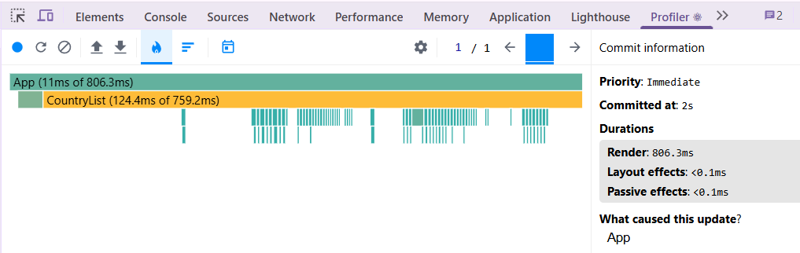
  - Ranked chart 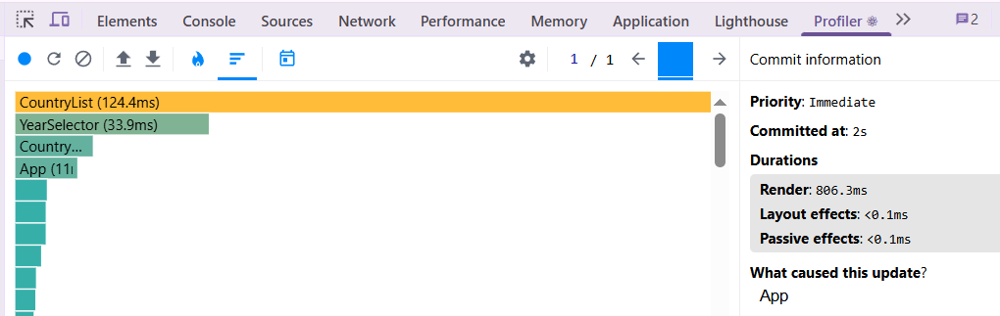

### Interaction B: Search countries

- **Commit duration**: 286 ms
- **Render duration**: 286 ms
- **Layouts effects**: <0.1 ms
- **Passive effects**: <0.1 ms
- **Screenshot**:
  - Flamegraph chart 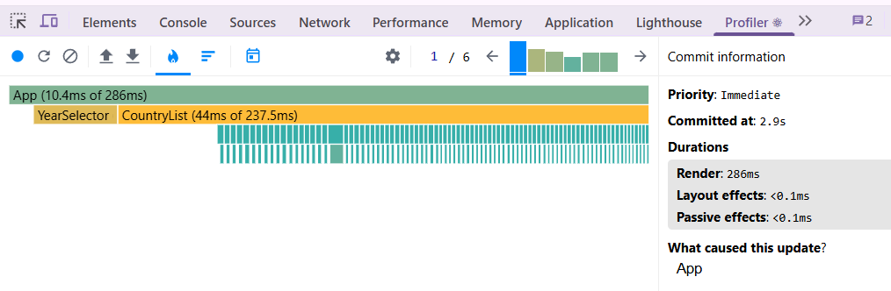
  - Ranked chart 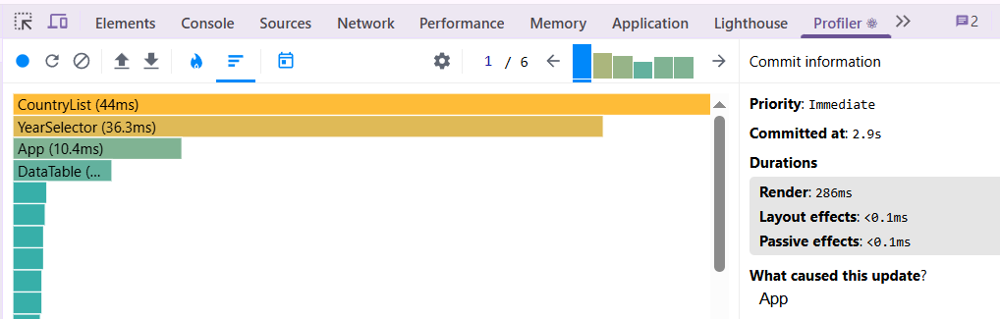

### Interaction C: Change year

- **Commit duration**: 806.2 ms
- **Render duration**: 860.2 ms
- **Layouts effects**: <0.1 ms
- **Passive effects**: <0.1 ms
- **Screenshot**:
  - Flamegraph chart 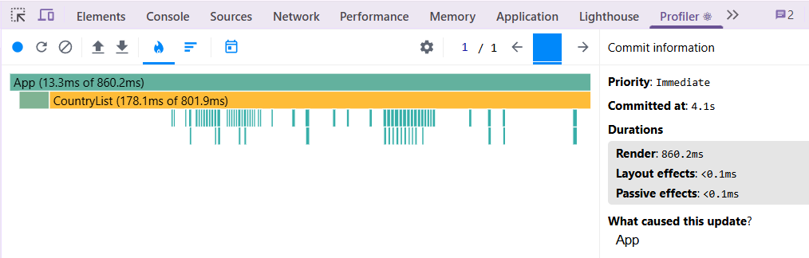
  - Ranked chart 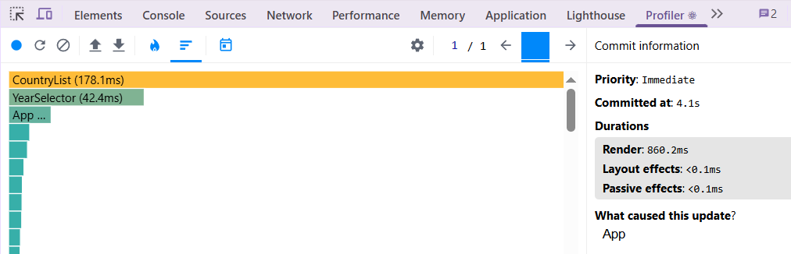

### Interaction D: Toggle column

- **Commit duration**: 854.7 ms
- **Render duration**: 854.7 ms
- **Layouts effects**: <0.1 ms
- **Passive effects**: <0.1 ms
- **Screenshot**:
  - Flamegraph chart 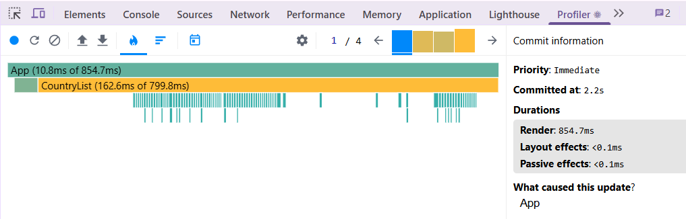
  - Ranked chart 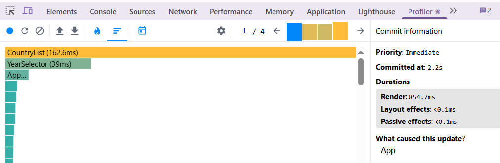

## Optimized Measurements

### Interaction A: Sort countries

- **Commit duration**: 46.2 ms
- **Render duration**: 42.7 ms
- **Layouts effects**: 3.4 ms
- **Passive effects**: 0.1 ms
- **Screenshot**:
  - Flamegraph chart 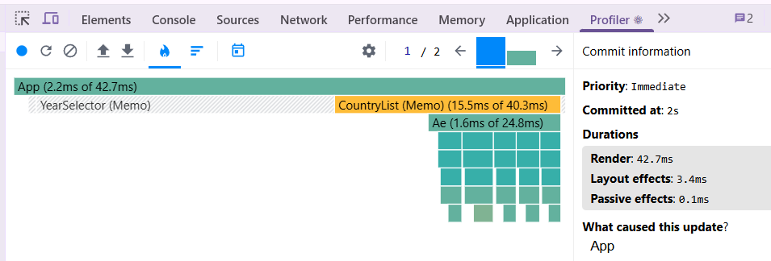
  - Ranked chart 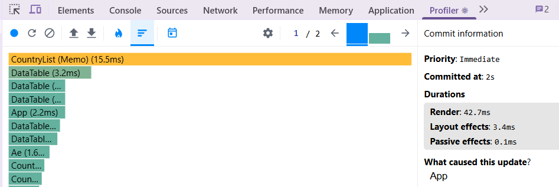

### Interaction B: Search countries

- **Commit duration**: 43.8 ms
- **Render duration**: 40.3 ms
- **Layouts effects**: 3.5 ms
- **Passive effects**: <0.1 ms
- **Screenshot**:
  - Flamegraph chart 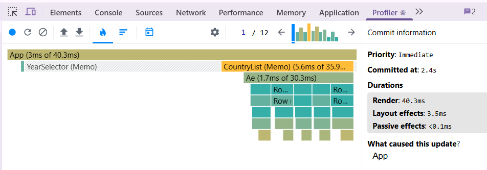
  - Ranked chart 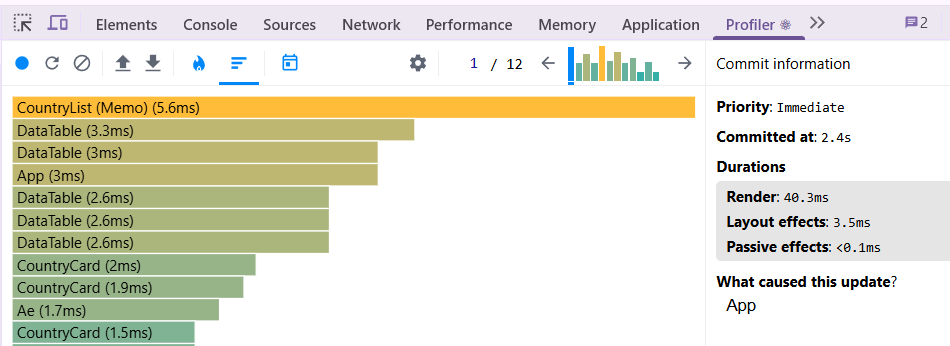

### Interaction C: Change year

- **Commit duration**: 98.4 ms
- **Render duration**: 96.8 ms
- **Layouts effects**: 1.6 ms
- **Passive effects**: <0.1 ms
- **Screenshot**:
  - Flamegraph chart 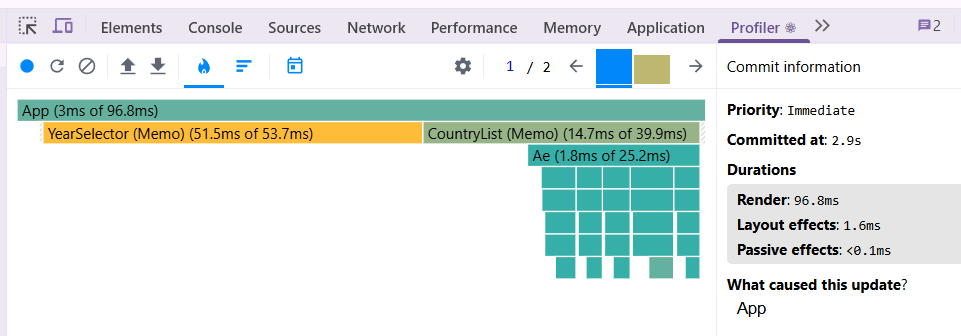
  - Ranked chart 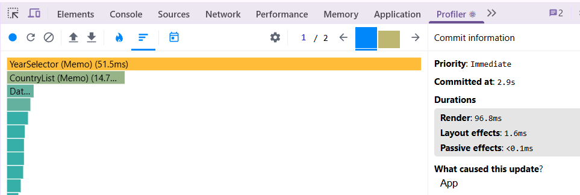

### Interaction D: Toggle column

- **Commit duration**: 16.4 ms
- **Render duration**: 16.4 ms
- **Layouts effects**: <0.1 ms
- **Passive effects**: <0.1 ms
- **Screenshot**:
  - Flamegraph chart 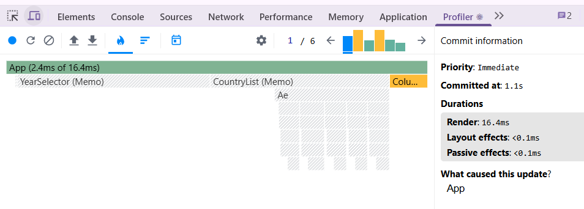
  - Ranked chart 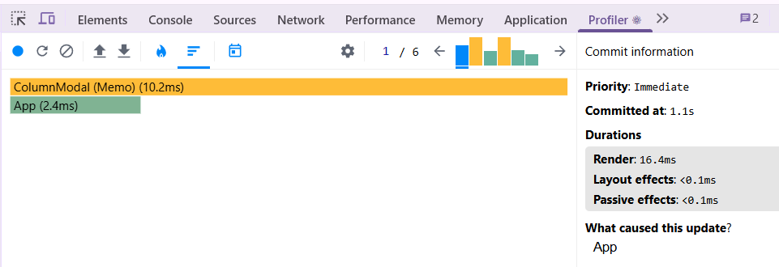

## Summary of Improvements

| Interaction      | Baseline (ms) | Optimized (ms) | Improvement |
| ---------------- | ------------- | -------------- | ----------- |
| Sort countries   | 806.3         | 46.2           | 94.3%       |
| Search countries | 286           | 43.8           | 84.7%       |
| Change year      | 860.2         | 98.4           | 88.6%       |
| Toggle column    | 854.7         | 16.4           | 98.1%       |
| **Average**      | **701.8**     | **51.4**       | **91.4%**   |
